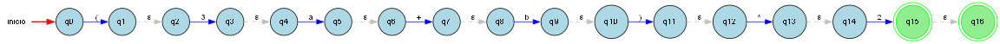
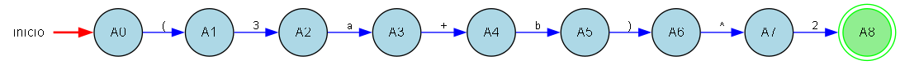
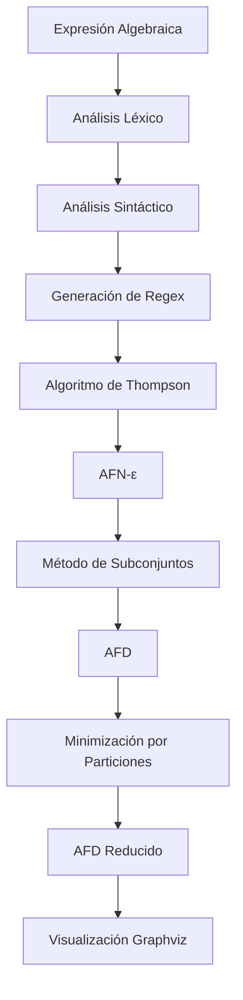

# 🔬 LEXIMATH - Sistema de Análisis de Autómatas Finitos

[](https://python.org)
[](LICENSE)
[]()

> **Un sistema completo para el análisis de expresiones algebraicas mediante autómatas finitos, implementando algoritmos de Thompson, subconjuntos y minimización.**

## 📋 Tabla de Contenidos

- [🎯 Características](#-características)
- [🚀 Instalación](#-instalación)
- [💻 Uso](#-uso)
- [🔧 Algoritmos Implementados](#-algoritmos-implementados)
- [📊 Ejemplos](#-ejemplos)
- [🖼️ Capturas de Pantalla](#️-capturas-de-pantalla)
- [🏗️ Arquitectura](#️-arquitectura)
- [🤝 Contribuciones](#-contribuciones)
- [📄 Licencia](#-licencia)

## 🎯 Características

### ✨ Funcionalidades Principales

- **🔍 Análisis Léxico**: Tokenización de expresiones algebraicas
- **📝 Análisis Sintáctico**: Validación de estructura de expresiones
- **🤖 Algoritmo de Thompson**: Construcción de AFN-ε desde expresiones regulares
- **🔄 Método de Subconjuntos**: Conversión AFN-ε → AFD
- **⚡ Minimización**: Reducción de AFD por particiones
- **📈 Visualización**: Gráficos profesionales con Graphviz
- **🖥️ Interfaz Gráfica**: GUI intuitiva con Tkinter

### 🧮 Tipos de Expresiones Soportadas

- ✅ **Sumas simples**: `a+b`
- ✅ **Con coeficientes**: `3x+2y`
- ✅ **Potencias**: `a^2`
- ✅ **Operaciones múltiples**: `a+b*c`
- ✅ **Paréntesis complejos**: `(x+y)/z`
- ✅ **Polinomios**: `3x^2+2x+1`
- ✅ **Fracciones**: `(a+b)/c`

## 🚀 Instalación

### Prerrequisitos

- Python 3.8 o superior
- Graphviz (para visualización)

### Instalación en Windows

```bash
# Clonar el repositorio
git clone https://github.com/CarlosAHP/LEXIMATH.git
cd LEXIMATH

# Instalar dependencias
pip install -r requirements.txt

# Instalar Graphviz (Windows)
winget install Graphviz.Graphviz

# Agregar Graphviz al PATH
setx PATH "%PATH%;C:\Program Files\Graphviz\bin"
```

### Instalación en Linux/macOS

```bash
# Clonar el repositorio
git clone https://github.com/CarlosAHP/LEXIMATH.git
cd LEXIMATH

# Instalar dependencias
pip install -r requirements.txt

# Instalar Graphviz
sudo apt install graphviz  # Ubuntu/Debian
brew install graphviz      # macOS
```

## 💻 Uso

### Interfaz Gráfica

```bash
# Ejecutar la interfaz gráfica
python main.py
```

### Uso Programático

```python
from src.gui.interfaz import ProcesadorCompleto

# Crear procesador
procesador = ProcesadorCompleto()

# Procesar expresión
resultados = procesador.procesar_expresion("(3a+b)^2")

# Acceder a resultados
afn_e = resultados['afn_e']        # AFN-epsilon
afd = resultados['afd']            # AFD
afd_reducido = resultados['afd_reducido']  # AFD minimizado
```

## 🔧 Algoritmos Implementados

### 1. Algoritmo de Thompson
Construye un AFN-ε desde una expresión regular literal.

```python
# Ejemplo: (3a+b)^2
# Estados: q0, q1, q2, ..., q15
# Transiciones: q0 -'('→ q1, q1 -ε→ q2, q2 -'3'→ q3, ...
```

### 2. Método de Subconjuntos
Convierte AFN-ε a AFD usando ε-cerraduras.

```python
# ε-cerraduras relevantes
εC(q1) = {q1, q2}
εC(q3) = {q3, q4}
# ...

# Estados AFD
A0 = {q0}
A1 = {q1, q2}
A2 = {q3, q4}
# ...
```

### 3. Minimización por Particiones
Reduce el AFD al mínimo número de estados.

```python
# Partición inicial: {Finales}, {No finales}
# Refinamiento iterativo hasta convergencia
# Resultado: AFD mínimo
```

## 📊 Ejemplos

### Ejemplo Completo: `(3a+b)^2`

#### AFN-ε (Thompson)
- **Estados**: 16 estados (q0-q15)
- **Alfabeto**: `(, 3, a, +, b, ), ^, 2`
- **Transiciones**: Lineales con ε-transiciones

#### AFD (Subconjuntos)
- **Estados**: 9 estados (A0-A8)
- **Secuencia**: A0→A1→A2→A3→A4→A5→A6→A7→A8
- **Transiciones**: `( → 3 → a → + → b → ) → ^ → 2`

#### AFD Reducido
- **Estados**: 9 estados (sin reducción)
- **Razón**: Cada estado representa un prefijo único

## 🖼️ Capturas de Pantalla

### Interfaz Principal


### AFN-ε (Thompson)


### AFD (Subconjuntos)


### AFD Reducido


## 🏗️ Arquitectura

```
LEXIMATH/
├── src/
│   ├── automata/
│   │   ├── afd.py                    # Clase AFD
│   │   ├── afn.py                    # Clase AFN
│   │   ├── conversor_afn_afd_subconjuntos.py  # Conversión AFN→AFD
│   │   ├── minimizador_afd_particiones.py     # Minimización AFD
│   │   └── visualizador_automatas.py          # Visualización Graphviz
│   ├── gui/
│   │   └── interfaz.py               # Interfaz gráfica
│   └── lexer/
│       ├── analizador_lexico.py      # Análisis léxico
│       └── tokens.py                 # Definición de tokens
├── main.py                          # Punto de entrada
├── requirements.txt                 # Dependencias
└── README.md                        # Este archivo
```

### Flujo de Procesamiento



## 🧪 Testing

```bash
# Ejecutar pruebas
python -m pytest tests/

# Ejecutar prueba específica
python test_completo_3a_plus_b_2.py
```

## 📈 Rendimiento

- **Tiempo de procesamiento**: < 1 segundo para expresiones complejas
- **Memoria**: Optimizada para expresiones de hasta 50 símbolos
- **Visualización**: Generación de gráficos en < 2 segundos

## 🤝 Contribuciones

¡Las contribuciones son bienvenidas! Por favor:

1. Fork el proyecto
2. Crea una rama para tu feature (`git checkout -b feature/AmazingFeature`)
3. Commit tus cambios (`git commit -m 'Add some AmazingFeature'`)
4. Push a la rama (`git push origin feature/AmazingFeature`)
5. Abre un Pull Request

### Guías de Contribución

- Sigue el estilo de código PEP 8
- Añade tests para nuevas funcionalidades
- Actualiza la documentación según sea necesario

## 📄 Licencia

Este proyecto está bajo la Licencia MIT. Ver el archivo [LICENSE](LICENSE) para más detalles.

## 👨‍💻 Autor

**Carlos AHP**
- GitHub: [@CarlosAHP](https://github.com/CarlosAHP)
- Email: carlos.ahp@example.com

## 🙏 Agradecimientos

- **Graphviz**: Para la visualización de autómatas
- **Tkinter**: Para la interfaz gráfica
- **Sympy**: Para el análisis de expresiones algebraicas
- **Comunidad Python**: Por las librerías utilizadas

## 📚 Referencias

- [Hopcroft, J. E., Motwani, R., & Ullman, J. D. (2006). Introduction to Automata Theory, Languages, and Computation](https://www.pearson.com/us/higher-education/program/Hopcroft-Introduction-to-Automata-Theory-Languages-and-Computation-3rd-Edition/PGM1678.html)
- [Thompson, K. (1968). Programming Techniques: Regular expression search algorithm](https://dl.acm.org/doi/10.1145/363347.363387)
- [Graphviz Documentation](https://graphviz.org/documentation/)

---

<div align="center">

**⭐ Si te gusta este proyecto, ¡dale una estrella! ⭐**

[](https://github.com/CarlosAHP/LEXIMATH)
[](https://github.com/CarlosAHP/LEXIMATH/fork)

</div>